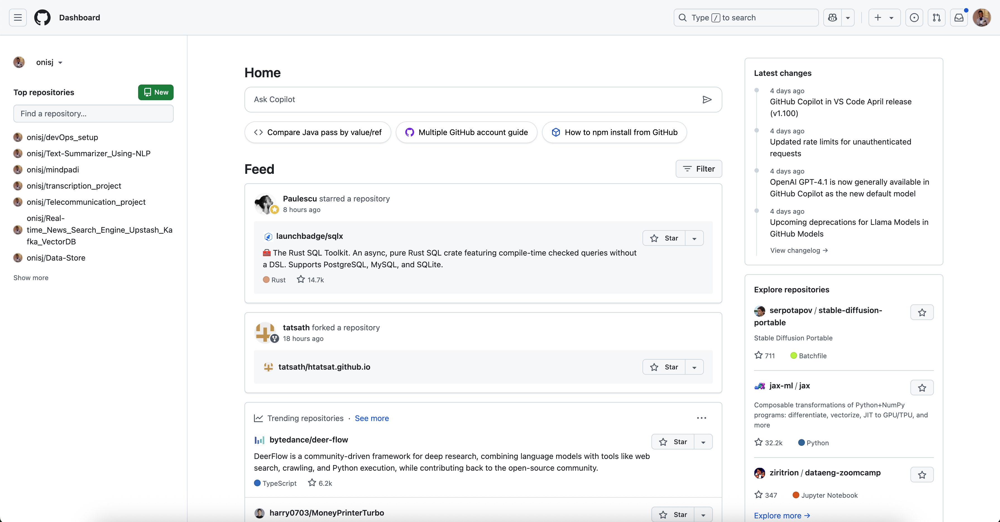
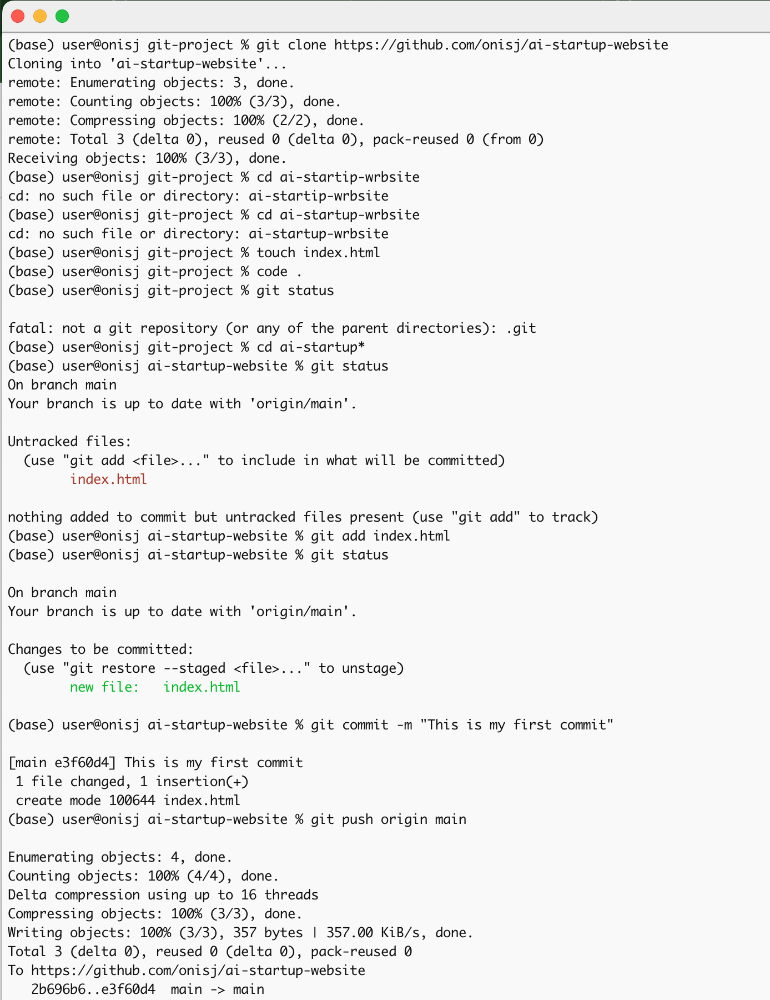
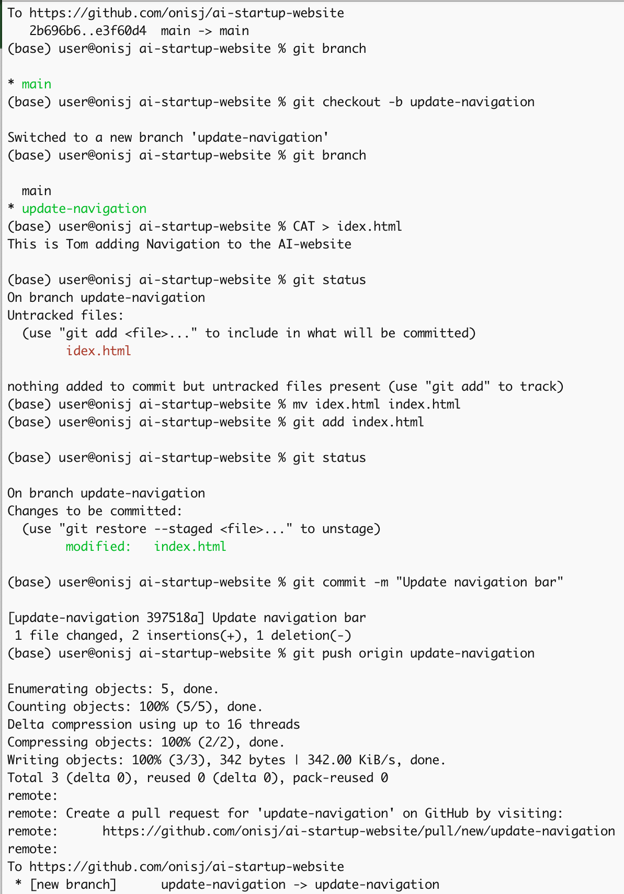
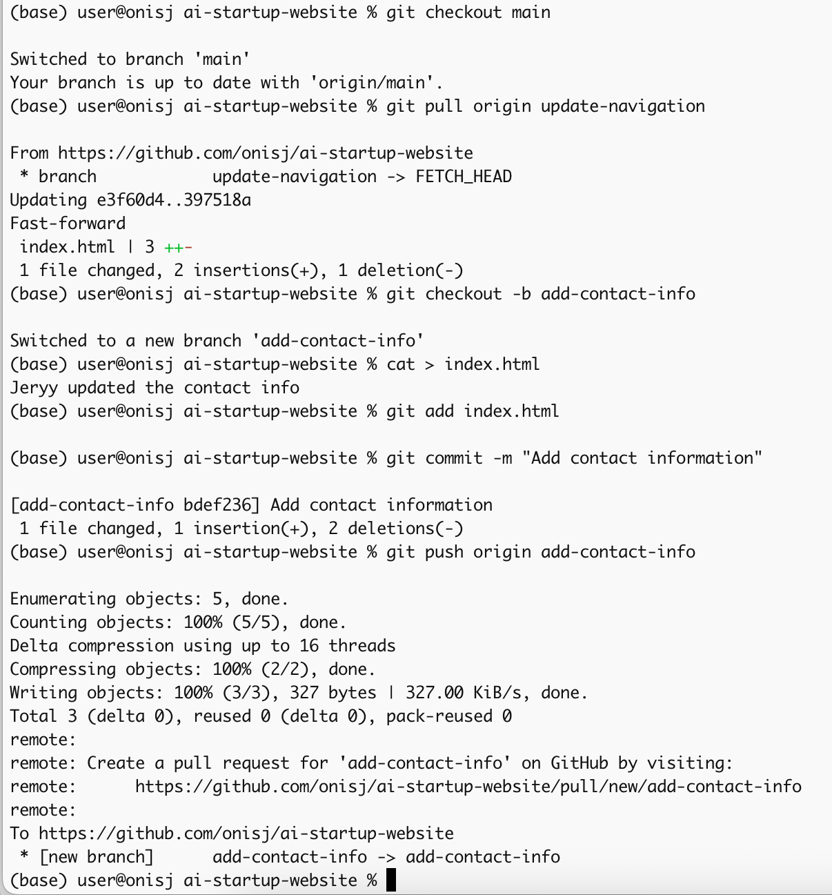
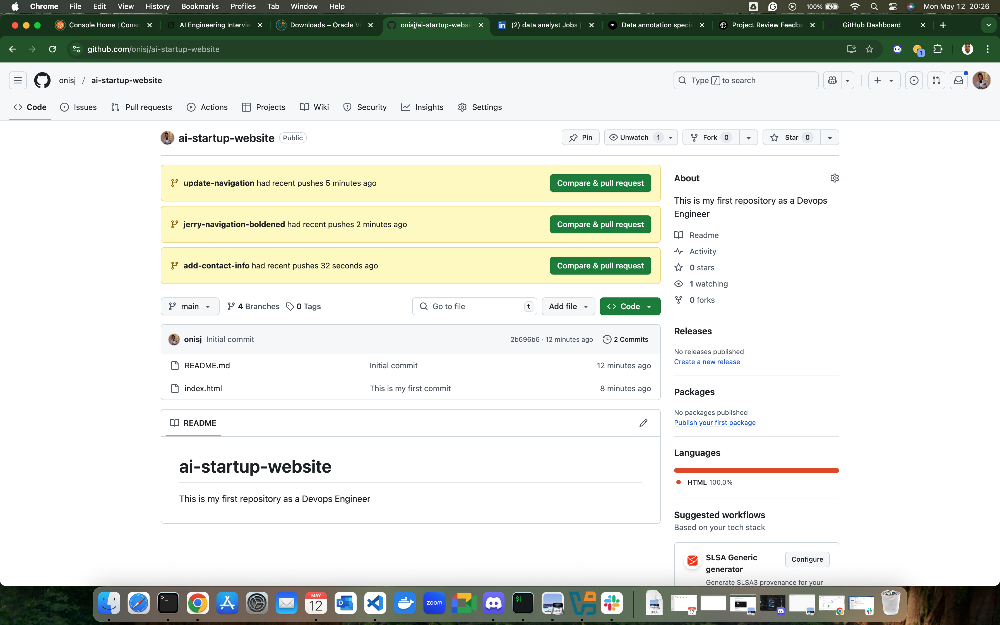

# AI Startup Website — Git Collaboration Project

## 👨‍💻 Project Overview

This project demonstrates Git and GitHub collaboration workflows, including:

- Git installation and verification
- Repository cloning and branch creation
- Collaboration simulation with two contributors: **Tom** and **Jerry**
- Structured commits and branch merging
- Hosting an `index.html` file in the GitHub repository

## ✅ Criteria Fulfillment

### 1. Git Setup & Initialization

Git is installed and verified:

### 2. GitHub Setup & Dashboard

GitHub account was created, and the repository `ai-startup-website` was initialized:

- 🔗 [GitHub Repo: ai-startup-website](https://github.com/onisj/ai-startup-website)

### 3. GitHub Clone of Repository

GitHub account was cloned using the `git clone` command,:

- 🔗 [GitHub Repo: ai-startup-website](https://github.com/onisj/ai-startup-website)

### 4. Branching & Collaboration Workflow

#### 👤 Tom's Contribution
- Branch Created: `update-navigation`
- Commit: `"Update navigation bar"`
- Screenshot:
  
  

#### 📞 Jerry's Contact Info Update
- Branch Created: `add-contact-info`
- Commit: `"Add contact information"`
- Screenshot:
  
  

#### 🧑‍🦰 Pull Request on Github
- The pull request generated on github after the commit from the Tom and Jerry
- Screenshot:
  
  

# 4. Git Operations Demonstrated

| Git Feature              | Demonstrated? | Evidence                          |
|--------------------------|---------------|------------------------------------|
| Git Installation         | ✅            | `git --version` screenshot         |
| Repository Cloning       | ✅            | Terminal logs included             |
| Branch Creation          | ✅            | `git checkout -b` commands         |
| Staged Commits           | ✅            | `git add` + `git commit` logs      |
| Push to GitHub           | ✅            | `git push origin branch-name`      |
| Merge Workflow           | ✅            | `git pull` for merging branches    |
| Collaboration Simulation | ✅            | Separate branches: Tom & Jerry     |

---

## 🧾 Repository File Tree

